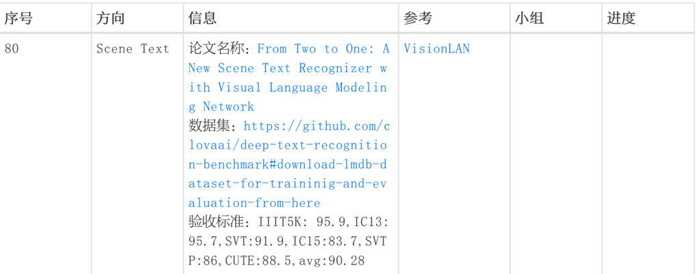

# VisionLAN 

# 1.安装环境
Python 2.7
Paddle想用最新版那就用了2.2rc

# 2.运行结果

## pytorch

# 3.打卡过程

>  思路：
>  1. 真实还原运行过程，对齐的数据均是边打断点运行torch代码，边序列化的
>  2. 解耦模块化

# 4.论文阅读

# 参考博客
https://blog.csdn.net/york1996/article/details/111039884